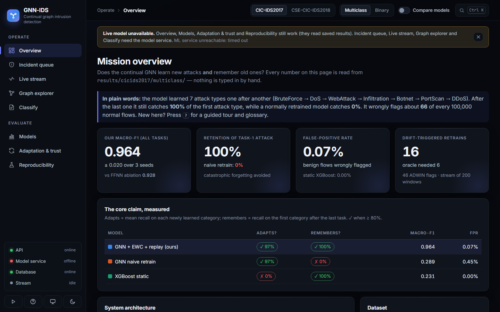

# Continual-Learning GNN Intrusion Detection

[](https://github.com/samarthdivekar/Continuous-learning-IDS/actions/workflows/tests.yml)

A network intrusion detection system (NIDS) that models traffic as graphs (hosts = nodes, flows = edges),
classifies flows with an edge-featured GraphSAGE network, **keeps learning new attack types without
forgetting old ones** (EWC + subgraph replay) and **only retrains when an ADWIN drift detector confirms
that behaviour changed**.

Final-year B.Tech project. Every number in this repository is produced by the scripts in
`experiments/` from the public datasets and is written to `results/`. Where the evidence does not
support the expected story, the README says so.

> **Demo walkthrough: [`DEMO.md`](DEMO.md)** (what to show, in order, with the numbers to quote).
>
> **Headline results and all tables: [`results/RESULTS.md`](results/RESULTS.md)** (generated from CSVs,
> never edited by hand). A summary with interpretation is in [Results](#results) below.
>
> **What it is for, and what it is not: [`docs/positioning.md`](docs/positioning.md)** (a continual-learning
> triage layer on an existing IDS's alert stream, not a SOC platform) and the
> **[model card](docs/model-card.md)** (intended use, data, metrics with their split, failure modes).

---

## Contents
1. [What is compared](#what-is-compared)
2. [Datasets](#datasets)
3. [Setup](#setup)
4. [Reproducing results](#reproducing-results)
5. [Running the system (API + dashboard)](#running-the-system)
6. [Design](#design)
7. [Evaluation protocol](#evaluation-protocol)
8. [Results](#results)
9. [Known limitations and honest caveats](#known-limitations-and-honest-caveats)
10. [How this compares to existing work](#how-this-compares-to-existing-work)
11. [Security notes](#security-notes)
12. [Future work](#future-work-scoped-out-deliberately)
13. [Repository layout](#repository-layout)
14. [Appendix: topology augmentation](#appendix-topology-augmentation)
15. [References](#references)

---

## What is compared

| Model | Adapts to new attacks? | Remembers old attacks? | Role |
|---|---|---|---|
| XGBoost, trained once on task 1 | no | yes (but blind to new) | static baseline |
| E-GraphSAGE, naive fine-tuning | yes | no (expected: catastrophic forgetting) | control |
| **E-GraphSAGE + EWC + subgraph replay + ADWIN** | yes | yes | **ours** |
| FFNN + EWC + replay (same flows, no graph) | yes | yes | ablation: does the graph help? |

Also run as component ablations / references: `gnn_ewc`, `gnn_replay`, `ffnn_naive`, and joint retraining
on all data so far (`gnn_joint`, `ffnn_joint`; a non-continual upper bound).

## Datasets

We use the **error-corrected** releases, not the original CIC CSVs. The originals contain documented
labelling and flow-construction errors (Engelen et al. 2021; Liu et al. 2022): mislabeled attack flows,
flows that never carried an attack payload, and CICFlowMeter bugs. Using corrected data is a deliberate
contribution of this project.

| Dataset | File | Size | Source |
|---|---|---|---|
| CIC-IDS2017 (improved) | `CICIDS2017_improved.zip` | 328 MB (2.1 M flows) | https://intrusion-detection.distrinet-research.be/CNS2022/Datasets/ |
| CSE-CIC-IDS2018 (improved) | `CSECICIDS2018_improved.zip` | 9.9 GB zip, 36 GB CSV (63.2 M flows) | same page |

Place both zips in `data/raw/`. The 2017 archive is extracted automatically; the 2018 archive is read as a
stream directly from the zip (no 36 GB extraction).

**CSE-CIC-IDS2018 is subsampled label-agnostically.** Its 63.2 M flows do not fit 24 GB RAM with 83 float
features, so every flow is kept with probability 0.15 *regardless of its label* (seeded) — a 1-in-~7
sampled flow export (9.48 M flows, 1,898 windows). An earlier version kept all attacks and thinned only
benign flows; the integrity review showed that let ground-truth labels decide which edges the GNN saw
(including in test windows), so it was replaced and every 2018 result was regenerated.

```bash
curl -L -o data/raw/CICIDS2017_improved.zip https://intrusion-detection.distrinet-research.be/CNS2022/Datasets/CICIDS2017_improved.zip
```

```bash
curl -L -o data/raw/CSECICIDS2018_improved.zip https://intrusion-detection.distrinet-research.be/CNS2022/Datasets/CSECICIDS2018_improved.zip
```

**Newer datasets.** Post-2018 candidates were reviewed and none were used: the BCCC releases (2024–25)
re-extract the *same* 2017/2018 traffic and sit behind a request form; UWF-ZeekData22 (2022) is 99.97 %
reconnaissance (effectively one attack class); LUFlow (2020–21) is real traffic but labelled only
benign/malicious/outlier; the NetFlow-v3 datasets (2025) re-encode older captures; TII-SSRC-23 (2023) is
the closest fit (CICFlowMeter-style flows, several attack families) and is the natural next dataset.
Only 2017/2018 have published error-correction studies, which this project relies on. The loader is dataset-agnostic (`src/ingestion/`), so an additional CICFlowMeter-style
dataset needs only a config overlay in `configs/` and, if its labels differ, entries in
`src/ingestion/labels.py`.

### Label handling
* Categories: Benign, BruteForce, DoS, WebAttack, Infiltration, Botnet, PortScan, DDoS (`configs/default.yaml`).
* `"<attack> - Attempted"` flows (attack traffic without a malicious payload, as tagged by the corrected
  releases) are relabelled **Benign** by default (`preprocessing.attempted_policy`: `benign | drop | attack`).
* CIC-IDS2017 "Infiltration - Portscan" (a port scan run from the compromised victim) is kept as
  **Infiltration**, as labelled by the dataset. Behaviourally it is a port scan, which explains much of
  the PortScan↔Infiltration confusion reported below.
* CSE-CIC-IDS2018 has no stand-alone PortScan category (its NMAP scan is part of Infiltration) and its
  FTP brute force is entirely "Attempted", so BruteForce there is SSH only.

## Setup

Tested on Windows 11, Python 3.12.10, NVIDIA GTX 1650 (4 GB), 24 GB RAM.

```bash
python -m venv .venv
```

Activate it (`.venv\Scripts\activate` on Windows, `source .venv/bin/activate` elsewhere), then install
PyTorch **first**, from the index that matches your hardware:

```bash
pip install torch==2.14.0 --index-url https://download.pytorch.org/whl/cu126
```

(CPU only: use `https://download.pytorch.org/whl/cpu`.) Then:

```bash
pip install -r requirements.txt
```

PyTorch Geometric 2.8 is used **without** its optional compiled extensions (`pyg-lib`, `torch-scatter`,
`torch-sparse`), whose Windows wheels lag behind PyTorch releases. Everything needed (message passing,
batching) is pure Python; neighbour sampling is implemented in `src/graph/sampling.py`.
`requirements.lock.txt` is the full `pip freeze` of the environment that produced the results.

Run the tests:

```bash
python -m pytest
```

Smoke-test the console in a real browser (stack running; uses the installed Edge through Playwright). It loads
every page and sub-page at desktop and phone width in both themes and fails on any uncaught error, any
console error other than an expected HTTP status, a page stuck loading, or horizontal overflow:

```bash
python scripts/ui_smoke.py
```

## Reproducing results

One command regenerates every number and figure from the raw zips:

```bash
python -m experiments.reproduce_all --dataset cicids2017
```

It runs, in order: data preparation → validation tuning → EWC λ/γ sweep (validation split) →
task-sequence experiment (multiclass + binary, seeds 42/43/44) → drift stream → leave-one-attack-out →
IP-remap → plots → `results/RESULTS.md` → database seed. Individual steps:

| Step | Command | Output |
|---|---|---|
| prepare | `python -m experiments.prepare_data --dataset cicids2017` | `data/processed/…`, `cache/graphs/…` |
| tuning (val) | `python -m experiments.tune_val` | `results/<ds>/multiclass/tuning/` |
| λ/γ sweep (val) | `python -m experiments.sweep_ewc_lambda` | `results/<ds>/multiclass/ewc_lambda_sweep/` |
| core table | `python -m experiments.run_continual --label-mode multiclass --seeds 42 43 44` | `results/<ds>/<mode>/continual/` |
| drift | `python -m experiments.run_drift_stream` | `results/<ds>/multiclass/drift/` |
| LOAO | `python -m experiments.run_loao --label-mode binary` | `results/<ds>/<mode>/loao/` |
| IP remap | `python -m experiments.run_ip_remap` | `results/<ds>/multiclass/ip_remap/` |
| figures | `python -m experiments.make_plots --label-mode multiclass` | `*.png` next to the CSVs |
| report | `python -m experiments.make_report` | `results/RESULTS.md` |
| novelty (§7) | `python -m experiments.run_open_set` | `results/<ds>/multiclass/open_set/` |
| abstention (§7) | `python -m experiments.run_conformal` | `results/<ds>/multiclass/conformal/` |
| incidents (§7) | `python -m experiments.run_incidents --budgets 0 0.001 0.0001 0.00001` | `results/<ds>/multiclass/incidents/` |
| safety gate (§7) | `python -m experiments.run_drift_stream --runs gnn_ewc_replay:adwin_gate --out-name drift_gate` | `results/<ds>/multiclass/drift_gate/` |
| label budget (§7) | `python -m experiments.run_drift_stream --runs gnn_ewc_replay:adwin --out-name drift_al100_hybrid --set drift.label_budget=100 drift.label_strategy=hybrid` | `results/<ds>/multiclass/drift_al100_hybrid/` |
| topology augmentation (appendix) | `python -m experiments.run_continual --seeds 42 43 44 --models gnn_ewc_replay_topo --out-name appendix_topo --no-checkpoints` and `python -m experiments.run_ip_remap --models gnn_ewc_replay_topo` | `appendix_topo/`, `ip_remap/` |

The §7 scripts need the per-task checkpoints written by the core-table step.

Add `--dev` to any command for a fast 20 %-of-windows development run (written to `results/dev/`,
never reported).

**CSE-CIC-IDS2018** multiclass was run with three seeds (42/43/44) for the four headline models; the
remaining ablations, and binary mode, keep their single seed, and the two joint-retraining references were
skipped (compute budget). It reuses the CIC-IDS2017 validation selections (`tuning_from` in
`configs/csecicids2018.yaml`).
The exact commands:

```bash
python -m experiments.prepare_data --dataset csecicids2018
python -m experiments.run_continual --dataset csecicids2018 --label-mode multiclass --seeds 42 --models xgboost_static gnn_naive gnn_ewc_replay ffnn_ewc_replay ffnn_naive gnn_ewc gnn_replay
python -m experiments.run_drift_stream --dataset csecicids2018 --label-mode multiclass
python -m experiments.run_continual --dataset csecicids2018 --label-mode binary --seeds 42 --models xgboost_static gnn_naive gnn_ewc_replay ffnn_ewc_replay ffnn_naive gnn_ewc gnn_replay
python -m experiments.run_ip_remap --dataset csecicids2018 --label-mode multiclass
python -m experiments.run_loao --dataset csecicids2018 --label-mode binary
```

Runtime on the reference machine (GTX 1650): CIC-IDS2017 preparation ≈ 1 min and full reproduction
≈ 3 h; CSE-CIC-IDS2018 preparation ≈ 40 min and the runs above ≈ 8 h.

Every results directory contains `run_info.json`: seed, full resolved config, package versions, GPU,
the command line and the processed-data hash.

## Running the system

### Local stack

`scripts/run_stack.ps1` runs the same five layers as local processes: SQLite for data, the ML service
(port 8001), the public API (port 8000, forwarding ML calls to the ML service) and a
small static server with an `/api` proxy in place of nginx (port 8080):

```bash
powershell -ExecutionPolicy Bypass -File scripts/run_stack.ps1
```

Open **http://localhost:8080**; stop with `scripts/run_stack.ps1 -Stop`. First load the results into the
database once with `python -m src.db.seed --dataset cicids2017 --label-mode multiclass` (the stack script
does this unless `-SkipSeed`). A single-process variant is `python -m uvicorn src.api.app:app --port 8000`.



The console has eight pages in two groups in the sidebar, *Operate* (what a security team uses) and *Evaluate* (the evidence
behind it). Every panel is fed by result files or live API data, and a missing experiment shows "not run yet",
never a number.

| Page | What it shows |
|---|---|
| Overview | the result in plain words, headline KPIs, the "adapts / remembers" verdict table, attack timeline, architecture |
| Incident queue | one window **or the last N windows** (a shift's queue); alerts grouped into incidents; per-incident explanation (feature attribution, network context, plain-English summary); proposed containment rule; approve / reject with a decision log (dry run); filters, a printable report and a CEF download |
| Live stream | replays the stream through four models; ADWIN flags, adaptations, per-window counts, drift feed, speed control, forced retrain |
| Graph explorer | any window graph as an interactive force layout (zoom, hover, category filters) with a per-flow **model-error overlay** |
| Classify | run the models on a held-out window or on an uploaded CSV with the full feature set (incomplete files are rejected, never imputed) |
| Models | *Accuracy & forgetting* (metric over tasks with ±1 std bands, recall heatmaps, BWT, confusion matrix) and *Unseen attacks & IP leakage* (leave-one-attack-out, IP-remap) |
| Adaptation & trust | *Drift & retraining* (ADWIN vs periodic vs oracle vs never) and *Trust* (open-set novelty, conformal abstention, alert → incident compression, gated / label-budgeted adaptation) |
| Reproducibility | λ sweep, tuning table, EWC stability ratios, run metadata |

Interface details that matter in a demo:

* **One model by default.** Charts show the deployed model and its two reference points; the **Compare models**
  switch in the top bar brings in every baseline and ablation.
* **Sidebar:** the pages, the state of the API, model service, database and stream, and buttons for the
  five-step **tour**, **help** (glossary), presentation mode and theme. `1`–`8` switch pages and
  `Ctrl`+`K` opens the command palette. Below 1200 px the sidebar becomes an icon rail; on a phone, a drawer.
* **A banner** appears when the ML service is down, naming the pages that still work.
* **⤓ buttons** export any panel as CSV (and the chart as PNG), for slides and reports.

The live stream warm-starts from the task-1 checkpoints written by `run_continual` (first seed) in
`cache/checkpoints/`; without them it trains task 1 itself first.

### One deployment path

`scripts/run_stack.ps1` is the only supported way to run the system. The Docker packaging (`Dockerfile`,
`docker-compose.yml`, `docker/`) was **deleted on 2026-10-06**: it had been verified once (2026-09-17) and not
exercised since, and two deployment paths with one maintained is a liability. PostgreSQL remains an option
for the database layer: set `DATABASE_URL` to a PostgreSQL URL before starting the stack (TimescaleDB
hypertables are created when the extension is installed; plain PostgreSQL also works).

### API

| Method | Path | Purpose |
|---|---|---|
| GET | `/health` | DB status, loaded models, device |
| POST | `/ingest` | store flow records (raw CICFlowMeter features, original or canonical names) |
| POST | `/predict` | classify posted flows, stored `flow_ids`, or a cached `window_id`; label + confidence per model |
| GET | `/metrics?source=continual\|stream` | accuracy / macro-F1 / retention / FPR series per model |
| GET | `/drift-status` | recent drift events, drift/retrain counts, live-stream status |
| POST | `/retrain` | force an adaptation cycle in the running live stream |
| GET | `/graph/{window_id}` | node/edge summary of a window graph (node ids only, no IPs) |
| GET | `/stream/windows` | per-window counts (Benign / Known attack / Novel-drifted) |
| POST | `/demo/start`, `/demo/stop`; GET `/demo/status` | live stream control |
| GET | `/windows/catalog` | every window with task, split and attack composition |
| GET | `/graph/{window_id}?model=…` | adds per-edge misclassification counts for the chosen model |
| GET | `/results/{index,continual,confusion,drift,loao,ip_remap,tuning,run_info,data_summary}` | read-only access to `results/` (404 if an experiment has not run) |

All routes are also served under `/api/…`. Interactive docs: `/docs`.

---

**Operator endpoints** (all served at `/` and `/api`):

| Endpoint | Purpose |
|---|---|
| `GET /incidents/{window}` | the window's alerts grouped into incidents, each with a proposed action |
| `GET /incidents/scan?limit=N` | the same across the most recent N windows, ranked by severity — a shift's queue |
| `GET /incidents/{window}/report?incident_id=N` | a printable one-page report (`fmt=json` for the raw payload) |
| `GET /incidents/{window}/cef` | the same incidents as ArcSight **CEF** lines for a SIEM to ingest |
| `GET /explain/{window}/{edge}` | feature, neighbourhood and structural evidence for one flow |
| `POST /actions`, `POST /actions/{id}/decision`, `GET /actions` | propose a containment action and record approve / reject (dry run) |

Set `GNNIDS_API_KEY` to require an `X-API-Key` header on every endpoint except `/health`.

**Feeding it your own traffic.** `python scripts/pcap_to_flows.py capture.pcap` converts a capture with
CICFlowMeter (install it separately; point to it with `--jar` or `CICFLOWMETER_JAR`), posts the flows to
`/ingest` and prints the verdicts. With an existing flow CSV, skip conversion: `--csv flows.csv`.

## Design

### Graph construction (`src/graph/window_builder.py`)
* Flows are sorted by timestamp (never shuffled globally) and cut into **windows of 5,000 flows**
  (`window.mode: count | time`, configurable). Windows never cross a task boundary.
* Per window: unique IPs → nodes, each flow → a directed edge carrying its **83 scaled CICFlowMeter
  features**. IPs define topology only; they are never features. `Flow ID`, `Timestamp` and the ephemeral
  `Src Port` are dropped from the feature vector (`Dst Port` and `Protocol` are kept as L4 features).
* Node features carry no identity: `[1, log(1+out-degree), log(1+in-degree)]` (`graph.node_features:
  degree`; `constant` = the original E-GraphSAGE choice). Degree makes fan-out (scans) and fan-in (DDoS)
  visible to a mean aggregator.
* Graphs are cached per task/split under `cache/graphs/<dataset>_<hash>/`; the hash covers every config
  value that affects the data.

### Preprocessing (`src/preprocessing/`)
* ±inf/NaN → 0 (zero-duration flows; imputing keeps the edge instead of silently deleting it). Exact
  duplicate records removed.
* Scaling: `sign(x)·log1p(|x|)` → StandardScaler **fitted on task-1 training flows only** → clip to ±10.
  The log step matters: a scaler fitted on task 1 alone otherwise produces z-scores in the thousands for
  later volumetric attacks.
* **Task partition** (`tasks.py`): attack bursts of each category are found from timestamps, the timeline
  is cut at midpoints between consecutive bursts, and each segment becomes the task of its category.
  Benign flows belong to the segment they fall in. For CIC-IDS2017 this yields
  BruteForce → DoS → WebAttack → Infiltration → Botnet → PortScan → DDoS (Monday's benign traffic joins
  task 1).
* **Class imbalance:** class-weighted cross-entropy, `w_c = (N / (K·n_c))^0.5`, clipped to [0.05, 50],
  instead of undersampling. Undersampling benign flows would delete edges and distort the graphs. The
  square root tempers weights so ~100-flow classes do not blow up the false-positive rate.

### E-GraphSAGE (`src/models/egraphsage.py`)
Two layers, 64 hidden units, based on Lo et al. (2022) with two documented changes:
(1) messages combine the neighbour's embedding with the flow's features, `W[h_u ‖ e_uv]`, so information
travels beyond one hop (in the original, layer 2 re-aggregates raw edge features);
(2) incoming and outgoing flows are aggregated separately, since direction distinguishes a scanner from
a victim. Edge logits come from `MLP([h_src ‖ h_dst ‖ P·e_uv])`. The model is **inductive**: no per-node
parameters. Windows are trained full-batch; windows above 20,000 edges (time-mode) use GraphSAGE-style
edge neighbour sampling (fan-outs 25/10).

### EWC (`src/models/ewc.py`), with the three traps from the brief
1. **Penalty only from completed tasks:** `penalty()` is exactly 0 until `consolidate()` has run, and
   `consolidate()` is only called after a task or adaptation cycle finishes. Test: `test_no_penalty_before_first_consolidation`.
2. **Fisher from the raw task gradient:** `consolidate()` runs its own backward pass on plain task
   cross-entropy (no penalty, no replay term). Test: `test_fisher_ignores_penalty_gradient`.
3. **lr·λ·F kept small:** per-consolidation Fisher is max-normalised, online accumulation uses decay γ,
   gradients are clipped, `lr·λ·max(F)` is logged and warned on, and λ/γ are swept on validation data
   (λ ∈ {1…10⁴}, γ ∈ {0.9, 1.0}). Test: `test_stability_warning`.

### Subgraph replay (`src/models/replay_buffer.py`), v1: whole windows
One reservoir-sampled pool per attack category (10 windows each). A window joins the pool of every
category it contains, so the pool is an unbiased sample over all windows of that category ever seen.
**Fixed budget per training step:** exactly 2 replayed windows, category drawn uniformly first, so the
old:new ratio is constant however many categories accumulate, and big historical categories (DoS Hulk)
do not crowd out small ones. The FFNN uses the same design with individual flow rows (5,000 per
category, 512 rows per step). v2 (k-hop neighbourhoods) was not needed: 10 windows × 7 categories fits in
memory easily.

### ADWIN (`src/drift/adwin_monitor.py`, `src/evaluation/stream.py`)
The monitored signal is each flow's 0/1 misclassification, assuming labels arrive with a delay (e.g.
analyst triage); a label-free confidence signal is available via `drift.signal: confidence`. Every flow
of a window is fed to ADWIN (δ = 0.002), and before the stream starts ADWIN is calibrated on held-out
task-1 windows so it knows the normal error level. The direction of a change is read *at each detection*
(river 0.26.1 resets the detector completely on the update after a detection). Only an increase triggers
adaptation, with a 5-window refractory period; decreases are logged but trigger nothing. An adaptation
cycle trains on the last 20 windows with the model's own strategy (EWC + replay for ours) and
consolidates EWC. No flag, no retraining.

Two earlier designs failed and are documented in `tests/test_drift.py`: one mean value per window gave
ADWIN too few, too noisy samples to ever fire on the real stream; and deciding direction once per window
mislabelled an attack burst that started and ended inside a window as a decrease.

### IP-leakage mitigations (brief §7)
1. Inductive GraphSAGE, no node embeddings. 2. IPs never enter any feature tensor (unit-tested).
3. **IP-remap evaluation** (`src/graph/ip_remap.py`), applied to test graphs of an already trained model:
   * `permute`: random bijection of hosts. Tests identity leakage. With identity-free node features the
     model is invariant **by construction**; the experiment confirms it numerically.
   * `random_src`: every flow gets an independent random source host from a pool of 65,536. Destroys the
     "one attacker = one hub" structure, so it measures how much performance depends on host-level topology.

## Evaluation protocol

* **Splits:** within each task, windows are assigned by position (period 10: position 5 → validation,
  positions 2 and 8 → test, others → train). Whole windows stay intact, and test windows are spread over
  the whole attack period (attacks are bursty; a chronological tail split would miss whole attack types).
  Tabular models use exactly the same flows (they read `edge_attr` from the same cached graphs).
* **Tuning uses the validation split only.** Test windows are touched only by the final runs.
* **Metrics** (all reported together, `src/evaluation/metrics.py`):
  accuracy and macro-F1 over test flows of all tasks seen so far (accuracy over time); **retention** =
  recall of the first attack category on task 1's test windows after every later task (task-1 accuracy is
  also logged, but it is >99 % benign and would hide forgetting); **FPR** = benign flows flagged as any
  attack; BWT/forgetting from the per-category recall matrix; per-task confusion matrices.
* **Seeds:** 42, 43, 44 for the interleaved task-sequence table and 42–46 for the temporal one (mean ± std,
  plus paired statistics in §2); CSE-CIC-IDS2018 multiclass uses 42–44. Everything else is one seed and is
  labelled **single run, indicative only** where it appears.
  cuDNN is deterministic, but PyG scatter ops on CUDA are not bit-exact, so reruns can differ in the last
  digits.
* **Leave-one-attack-out:** joint training on all other tasks (stray flows of the held-out category removed),
  testing on the held-out task; detection = held-out attack flows predicted as *any* attack.

## Results

Every number below comes from a CSV under `results/`; each table names its folder. Interleaved and temporal
are the two train/test protocols of §2. Anything run with one seed says so.

### 1. Attacks the model was never trained on (leave-one-attack-out, binary)

This is the result that separates the graph model from a per-flow model, and it is also the one whose
robustness is least settled. Each model is trained on every attack category but one and tested on the held-out
category; the table gives the share of the held-out category's flows flagged as an attack. The models are
trained jointly here (no continual learning), so the comparison isolates what the graph adds.

**CSE-CIC-IDS2018** (`results/csecicids2018/binary/loao/`, seed 42; second seed in `loao_seed43/`)

| Held out | XGBoost | FFNN (per-flow) | GNN (graph), seed 42 | GNN, seed 43 |
|---|---|---|---|---|
| DoS | 90.1 % | 0.1 % | **98.6 %** | **98.6 %** |
| BruteForce | 0.0 % | 0.0 % | 99.7 % | **0.0 %** |
| DDoS | 0.0 % | 0.0 % | 99.4 % | not run |
| Botnet | 0.0 % | 0.0 % | 8.5 % | not run |
| Infiltration | 0.0 % | 0.0 % | 0.0 % | not run |
| WebAttack | 0.0 % | 0.0 % | 0.0 % | not run |

* **Unseen DoS replicates.** The graph model flags 98.6 % of DoS flows it never saw in training, in both
  seeds, where the per-flow FFNN flags 0.06–0.07 %. XGBoost also catches most of it here (90.1 % and 84.8 %).
* **Unseen BruteForce does not.** 99.7 % in seed 42, **0.0 %** in seed 43. On one run this looked like the
  strongest evidence in the project; it is a property of one training run, not of the method.
* **The rest is one seed.** The seed-43 run was stopped by a machine restart after three held-out
  categories, before the GNN reached DDoS; DDoS (99.4 %) and the other rows are seed 42 only, indicative.
  No model detects unseen Infiltration or WebAttack (7 held-out flows in the 15 % sample), and the GNN
  catches 8.5 % of unseen Botnet.

**CIC-IDS2017** (`results/cicids2017/binary/loao/`, single run, seed 42, indicative only)

| Held out | XGBoost | FFNN (per-flow) | GNN (graph) |
|---|---|---|---|
| DoS | 0.7 % | 3.0 % | **67.7 %** |
| WebAttack | 0.0 % | 0.0 % | **54.2 %** |
| Infiltration | 26.9 % | 49.3 % | **67.7 %** |
| PortScan / DDoS | ≥ 98.8 % | ≥ 98.8 % | 100 % |
| BruteForce / Botnet | 0 % | ≤ 0.8 % | 0 % |

**Reading.** Host-level structure (fan-out, fan-in, who talks to whom) lets the graph model flag some attack
types a per-flow model cannot see at all; unseen DoS is the case that holds across seeds on 2018 and points
the same way on 2017. It is not a dependable property for every attack type: BruteForce flipped between two
seeds, and Infiltration, WebAttack and Botnet are mostly missed by every model. It also rests on attackers
being few hosts (§5).

### 2. Learning seven attacks in sequence (multiclass, in distribution)

CIC-IDS2017, seven attack categories learned one after another, metrics after the final task.

**Interleaved split** (`results/cicids2017/multiclass/continual/`, seeds 42/43/44)

| Model | Macro-F1 | Retention (task-1 recall) | FPR | BWT |
|---|---|---|---|---|
| XGBoost static (task 1 only) | 0.231 ± 0.000 | 1.000 | 0.00 % | 0.000 |
| GNN naive retrain | 0.289 ± 0.017 | **0.000** | 0.45 % | −0.830 |
| **GNN + EWC + replay (ours)** | **0.964 ± 0.020** | **1.000** | 0.07 % | −0.021 |
| FFNN + EWC + replay (ablation) | 0.928 ± 0.020 | 1.000 | 0.04 % | −0.029 |
| GNN + replay only | 0.948 ± 0.016 | 1.000 | 0.12 % | −0.040 |
| GNN + EWC only | 0.300 ± 0.001 | 0.000 | 0.37 % | −0.828 |
| GNN joint retrain (non-continual reference) | 0.951 ± 0.015 | 1.000 | 0.06 % | 0.031 |

**Temporal split** (`results/cicids2017/multiclass/continual_temporal/`, seeds 42–46; FFNN joint 4 seeds)

| Model | Macro-F1 | Retention (task-1 recall) | FPR | BWT |
|---|---|---|---|---|
| XGBoost static (task 1 only) | 0.236 ± 0.000 | 0.990 | 0.00 % | 0.000 |
| GNN naive retrain | 0.263 ± 0.055 | **0.000** | 0.19 % | −0.797 |
| **GNN + EWC + replay (ours)** | **0.915 ± 0.031** | **0.998** | 0.04 % | −0.050 |
| FFNN + EWC + replay (ablation) | 0.870 ± 0.009 | 0.997 | 0.04 % | −0.034 |
| GNN + replay only | 0.848 ± 0.089 | 0.994 | 0.08 % | −0.122 |
| GNN + EWC only | 0.377 ± 0.109 | 0.000 | 0.04 % | −0.646 |
| GNN joint retrain (non-continual reference) | 0.935 ± 0.008 | 0.997 | 0.04 % | −0.005 |
| FFNN joint retrain | 0.896 ± 0.003 | 0.995 | 0.02 % | −0.013 |

Our model's mean macro-F1 with a bootstrap 95 % CI over seeds: **0.915 [0.888, 0.935]** on the temporal split
(5 seeds) and 0.964 [0.941, 0.975] on the interleaved split (3 seeds; with three values the interval is
little more than their range).

#### What the temporal split cost

The interleaved split assigns windows to train / validation / test by position modulo 10 inside each task
(validation at 5, test at 2 and 8), so test windows sit minutes from training windows of the same attack
session. That is optimistic. The temporal split trains on the first 70 % of each task's windows, validates on
the next 10 % and tests on the last 20 %, with a one-window gap between blocks.

Applied naively, a chronological split leaves some attacks with nothing to test: on CIC-IDS2017 it gives
WebAttack and Botnet **0** test attack flows and DoS 11 (measured with `split.strategy: temporal`), because
those attacks sit at one end of their task's time span. The run above therefore uses
`split.strategy: temporal_attack`, which applies the same chronological 70/10/20 split separately to the
windows that carry the task's new attack and to the rest, so every attack is tested on its own latest
traffic. Test attack flows per task (`results/cicids2017/multiclass/split_report/`):

| Task | Interleaved | Temporal (per attack) |
|---|---|---|
| BruteForce | 1,280 | 1,358 |
| DoS | 33,606 | 19,857 |
| WebAttack | 24 | 21 |
| Infiltration | 16,434 | 17,496 |
| Botnet | 73 | 257 |
| PortScan | 29,277 | 20,071 |
| DDoS | 22,159 | 19,007 |

**The temporal split cost our model 0.049 macro-F1** (0.964 → 0.915), the FFNN 0.058 (0.928 → 0.870),
replay-only 0.100 (0.948 → 0.848) and joint retraining 0.016 (0.951 → 0.935). Read the drop with three
caveats: hyper-parameters were chosen on the interleaved validation split and reused unchanged; the seed sets
differ (3 vs 5); and the test windows differ, so the drop mixes temporal distance with test-set composition.

#### Are the differences real? (paired statistics, `results/stats/`, `python -m experiments.stats`)

Every seed trains both models on the same data with the same seed, so differences are paired. A difference is
called a difference only when the bootstrap 95 % CI of the mean paired difference excludes zero. With three or
five seeds the exact two-sided Wilcoxon test cannot go below 0.25 or 0.0625, so it can never reach p < 0.05
here; it is reported for completeness, and every verdict is indicative, not confirmatory.

| Comparison | Question | Metric | Seeds | Ours | Other | Mean diff | Bootstrap 95 % CI | Wilcoxon p (2-sided / 1-sided) | Verdict |
|---|---|---|---|---|---|---|---|---|---|
| 2017 · interleaved | does the graph help? | macro-F1 | 3 | 0.964 | 0.928 (ffnn_ewc_replay) | +0.036 | [+0.011, +0.069] | 0.250 / 0.125 | ours better (indicative, n=3) |
| 2017 · interleaved | does the graph help? | false-positive rate | 3 | 0.066 % | 0.043 % (ffnn_ewc_replay) | +0.023 pp | [+0.016 pp, +0.031 pp] | 0.250 / 1.000 | ffnn_ewc_replay better (indicative, n=3) |
| 2017 · temporal | does the graph help? | macro-F1 | 5 | 0.915 | 0.870 (ffnn_ewc_replay) | +0.044 | [+0.019, +0.058] | 0.125 / 0.062 | ours better (indicative, n=5) |
| 2017 · temporal | does the graph help? | false-positive rate | 5 | 0.042 % | 0.041 % (ffnn_ewc_replay) | +0.001 pp | [-0.032 pp, +0.035 pp] | 0.812 / 0.688 | no detectable difference |
| 2017 · interleaved | does EWC add anything to replay? | macro-F1 | 3 | 0.964 | 0.948 (gnn_replay) | +0.015 | [-0.016, +0.045] | 0.500 / 0.250 | no detectable difference |
| 2017 · interleaved | does EWC add anything to replay? | false-positive rate | 3 | 0.066 % | 0.116 % (gnn_replay) | -0.050 pp | [-0.087 pp, +0.004 pp] | 0.500 / 0.250 | no detectable difference |
| 2017 · temporal | does EWC add anything to replay? | macro-F1 | 5 | 0.915 | 0.848 (gnn_replay) | +0.067 | [+0.003, +0.145] | 0.188 / 0.094 | ours better (indicative, n=5) |
| 2017 · temporal | does EWC add anything to replay? | false-positive rate | 5 | 0.042 % | 0.075 % (gnn_replay) | -0.033 pp | [-0.069 pp, +0.000 pp] | 0.312 / 0.156 | no detectable difference |
| 2018 · interleaved | does the graph help? | macro-F1 | 3 | 0.881 | 0.836 (ffnn_ewc_replay) | +0.045 | [+0.004, +0.123] | 0.250 / 0.125 | ours better (indicative, n=3) |
| 2018 · interleaved | does the graph help? | false-positive rate | 3 | 0.346 % | 0.124 % (ffnn_ewc_replay) | +0.222 pp | [-0.234 pp, +0.455 pp] | 0.500 / 0.875 | no detectable difference |

* **The graph helps, modestly, on both splits.** +0.036 interleaved (n = 3) and +0.044 temporal (n = 5;
  per seed −0.005, +0.056, +0.054, +0.061, +0.055). The FFNN has the lower false-positive rate on the
  interleaved split; on the temporal split there is no detectable difference.
* **Replay is necessary; EWC alone fails** on both splits (0.300 and 0.377 macro-F1, retention 0).
* **Does EWC add anything on top of replay? Not detectably on the interleaved split; on the temporal split
  it did, indicatively.** EWC + replay beat replay-only by +0.067, CI [+0.003, +0.145], but the gain comes
  from two seeds in which replay-only collapsed (+0.208, +0.102); in the other three the difference is
  −0.021 to +0.027. This **revises the earlier claim that "replay does the work, EWC does not"**: EWC
  appears to stabilise replay when train and test are further apart. The replay-budget sweep below was run
  on the interleaved split only.
* **2018 is not settled.** +0.045 for the graph, but one seed carries it (+0.122; the others +0.004 and +0.009).

#### How much replay is enough? (replay-budget sweep, `results/cicids2017/multiclass/replay_budget_sweep/`)

EWC was given a λ/γ grid; this gives replay the same treatment. Replay-only GNN on the interleaved split, seeds
42–44, varying how many windows are stored per attack category (the step budget stays at two replayed windows):

| Stored windows per category | 0 | 1 | 5 | 10 (default) | 20 |
|---|---|---|---|---|---|
| Macro-F1 | 0.304 ± 0.007 | 0.702 ± 0.058 | 0.952 ± 0.012 | 0.948 ± 0.016 | 0.957 ± 0.039 |
| Retention (task-1 recall) | 0.000 | 0.667 | 1.000 | 1.000 | 1.000 |

With no stored windows replay-only is naive retraining (0.304, retention 0, as it should be). One window per
category recovers most of the forgetting; from five upwards the curve is flat and replay alone sits within
noise of EWC + replay at the default budget (0.964 ± 0.020). EWC alone fails at every λ of its sweep. So on the
interleaved split the conclusion is now evidenced symmetrically: **replay is what prevents forgetting, a small
buffer is enough, and EWC adds no detectable gain on top of it.** The temporal split is the exception above,
where EWC prevented two replay-only collapses; the sweep was not repeated there.
* **The expected forgetting pattern holds on both splits.** The static model never learns new attacks;
  naive retraining forgets the first attack completely; our model learns every new category and keeps
  retention at 0.998–1.000, close to a model retrained on all data.

### 3. Binary mode (attack vs benign, CIC-IDS2017)

Binary is domain-incremental (the "attack" class persists across tasks), and the picture changes:
ours 0.9993 macro-F1, FFNN + EWC + replay 0.9991, and **GNN + EWC only reaches 0.9945 with retention 1.0**
— on CIC-IDS2017, EWC alone works in the setting it was designed for (this did **not** replicate on
CSE-CIC-IDS2018). GNN naive keeps 0.76 retention; FFNN naive collapses
to 0.003. The static XGBoost detects only **1.3 %** of attack flows from categories it never saw.

### 4. Drift-triggered adaptation (stream of tasks 2–7; single run, seed 42, indicative only)

| Policy (our model) | Retrains | Final macro-F1 | Retention |
|---|---|---|---|
| ADWIN (drift-triggered) | 16 (46 flags) | 0.949 | 1.000 |
| Periodic, every 25 windows | 8 | 0.967 | 1.000 |
| Oracle (true task boundaries) | 6 | 0.952 | 1.000 |
| Never adapt | 0 | **0.232** | 1.000 |

Adapting is essential (0.95 vs 0.23), and ADWIN finds every task boundary without being told. But the
brief's efficiency goal is **not** met on this stream: ADWIN retrained 16 times where a fixed schedule
needed 8 and ended marginally lower. Attack bursts inside a task keep raising the error until the
model has adapted to them.

### 5. IP leakage (brief §7; single run, seed 42, indicative only)

| Model | Normal | Hosts permuted | Sources randomised |
|---|---|---|---|
| GNN + EWC + replay | 0.950 | 0.950 | **0.427** |
| FFNN + EWC + replay | 0.947 | 0.947 | 0.947 |

Permuting host identities changes nothing (no IP memorisation). Randomising each flow's source, which
destroys the "attacker = one hub" structure, cuts the GNN's macro-F1 from 0.950 to 0.427 and raises its
FPR to 1.99 %. See the limitations.

### 6. CSE-CIC-IDS2018

CSE-CIC-IDS2018: 6 tasks (BruteForce → DoS → DDoS → WebAttack → Infiltration → Botnet), 15 % label-agnostic
flow sample, **3 seeds (42, 43, 44)**, hyper-parameters reused from CIC-IDS2017, no joint-retraining references.

**Multiclass task sequence**

| Model | Macro-F1 | Retention | FPR | BWT | Seeds |
|---|---|---|---|---|---|
| XGBoost static | 0.282 | 1.000 | 0.00 % | 0.000 | 3 |
| GNN naive retrain | 0.298 ± 0.015 | 0.000 | 0.49 ± 0.02 % | -0.912 | 3 |
| **GNN + EWC + replay (ours)** | 0.881 ± 0.038 | 1.000 | 0.35 ± 0.29 % | -0.022 | 3 |
| FFNN + EWC + replay (ablation) | 0.836 ± 0.029 | 1.000 | 0.12 ± 0.10 % | -0.008 | 3 |
| GNN + replay only | 0.872 | 1.000 | 0.51 % | -0.041 | 1 |
| GNN + EWC only | 0.286 | 0.000 | 0.00 % | -0.831 | 1 |
| FFNN naive retrain | 0.282 | 0.000 | 0.00 % | -0.970 | 1 |

**Binary task sequence: withdrawn.** It was run with one seed, and in that seed the per-flow FFNN beat the graph model. One seed cannot support either claim, and the additional seeds could not be run, so the section was removed and the console no longer offers CSE-CIC-IDS2018 in binary mode. (The binary leave-one-attack-out experiment in §1 is separate and stays.)

**Drift-triggered adaptation** (stream of tasks 2–6; single run, seed 42, indicative only)

| Model / policy | Drift flags | Retrains | Final macro-F1 | Retention |
|---|---|---|---|---|
| GNN + EWC + replay (ours) / adwin | 50 | 24 | 0.943 | 1.000 |
| GNN + EWC + replay (ours) / periodic | 0 | 48 | 0.825 | 1.000 |
| GNN + EWC + replay (ours) / oracle | 0 | 5 | 0.999 | 1.000 |
| GNN + EWC + replay (ours) / never | 0 | 0 | 0.155 | 1.000 |
| GNN naive retrain / adwin | 39 | 20 | 0.281 | 0.000 |
| FFNN + EWC + replay (ablation) / adwin | 63 | 33 | 0.801 | 1.000 |
| XGBoost static / never | 0 | 0 | 0.282 | 1.000 |

**IP-remap** (macro-F1 of the same trained model; single run, seed 42, indicative only)

| Model | Normal | Hosts permuted | Sources randomised |
|---|---|---|---|
| GNN + EWC + replay (ours) | 0.948 | 0.948 | 0.754 |
| GNN naive retrain | 0.281 | 0.281 | 0.277 |
| FFNN + EWC + replay (ablation) | 0.850 | 0.850 | 0.850 |

**What 2018 confirms, and what it does not.**

* **Forgetting prevention replicates.** Every replay-based model keeps retention 1.0; naive retraining,
  FFNN naive and EWC-only drop to 0 (BWT −0.83 to −1.00), exactly as on CIC-IDS2017.
* **EWC alone fails here too.** In multiclass, EWC-only ends at 0.286 with retention 0 (one seed), as on
  CIC-IDS2017.
* **ADWIN paid off on this stream, in a single run.** 24 drift-triggered retrains beat a periodic schedule
  (48 retrains, 0.825) on both cost and quality (0.943), and the model without adaptation collapses to 0.155.
  On CIC-IDS2017 the same detector over-triggered (16 vs 8 periodic). Both are one seed, so the efficiency
  claim is indicative on one dataset and does not hold on the other.
* **GNN vs FFNN on 2018, over three seeds: no settled difference.** Multiclass macro-F1 is **0.881 ± 0.038**
  for the GNN against **0.836 ± 0.029** for the per-flow FFNN. The GNN is ahead in every seed, but by only
  0.004 and 0.009 in two of them; the bootstrap interval of the paired difference is [+0.004, +0.123] and is
  carried by the third seed (§2). The FFNN has the lower false-positive rate.
* **Unseen attacks:** see §1. Unseen DoS replicates across two seeds (98.6 % vs 0.1 % for the FFNN);
  unseen BruteForce does not (99.7 % in one seed, 0.0 % in the other).
* **The GNN is unstable on Infiltration.** The IP-remap experiment re-trains the identical configuration
  (same seed, same data). Its "normal" column scores **0.948** where the task-sequence run scored **0.855**.
  The whole gap is one class: the task-sequence run flagged **9,196** benign flows as Infiltration
  (FPR 0.51 %), the IP-remap run **3** (FPR 0.0014 %), with the same ~97–99 % Infiltration recall. Nothing
  differs between the runs except CUDA's non-deterministic scatter operations, so the GNN's decision
  boundary between benign traffic and the NMAP-style Infiltration traffic is fragile. The three-seed run
  bears this out: the GNN's macro-F1 spans 0.855–0.925 across seeds (± 0.038) and its false-positive rate
  averages 0.35 %, so any single 2018 GNN number should be read as one draw from a wide distribution.
* **Topology dependence replicates, less severely.** Randomising source hosts drops the GNN from 0.948 to
  0.754 (2017: 0.950 → 0.427) while the FFNN is unaffected; host permutation changes nothing.

### 7. Product layer: novelty, abstention, incidents, explanations, safe adaptation

These features sit on top of the trained continual models. They are evaluated with the same per-task checkpoints and test splits as §1–6. They answer questions a security team asks before trusting a detector. Scripts: `experiments/run_open_set.py`, `run_conformal.py`, `run_incidents.py`, and `run_drift_stream.py --out-name ...`.

**Would it notice an attack it was never taught?** (open-set detection)
After each task, the next task's attack category is still unknown. The detector must score it as more novel than known traffic. The table gives AUROC averaged over the unseen categories; 0.5 is chance.

| Dataset | Model | Score | Mean AUROC | Range |
|---|---|---|---|---|
| CIC-IDS2017 | FFNN + EWC + replay | energy | 0.471 | 0.019–0.973 (n=6) |
| CIC-IDS2017 | FFNN + EWC + replay | msp | 0.689 | 0.409–0.970 (n=6) |
| CIC-IDS2017 | FFNN + EWC + replay | prototype | 0.643 | 0.141–0.987 (n=6) |
| CIC-IDS2017 | GNN + EWC + replay (ours) | energy | 0.875 | 0.644–0.998 (n=6) |
| CIC-IDS2017 | GNN + EWC + replay (ours) | msp | 0.766 | 0.423–0.999 (n=6) |
| CIC-IDS2017 | GNN + EWC + replay (ours) | prototype | 0.749 | 0.177–0.997 (n=6) |
| CSE-CIC-IDS2018 | FFNN + EWC + replay | energy | 0.678 | 0.055–0.948 (n=5) |
| CSE-CIC-IDS2018 | FFNN + EWC + replay | msp | 0.627 | 0.486–0.996 (n=5) |
| CSE-CIC-IDS2018 | FFNN + EWC + replay | prototype | 0.780 | 0.460–1.000 (n=5) |
| CSE-CIC-IDS2018 | GNN + EWC + replay (ours) | energy | 0.842 | 0.271–0.999 (n=5) |
| CSE-CIC-IDS2018 | GNN + EWC + replay (ours) | msp | 0.834 | 0.477–0.997 (n=5) |
| CSE-CIC-IDS2018 | GNN + EWC + replay (ours) | prototype | 0.950 | 0.842–1.000 (n=5) |

On CIC-IDS2017, clustering the flows flagged as novel (k chosen by silhouette) proposes the true new attack as the largest GNN cluster for DoS (87 % pure), Infiltration (97 % pure), DDoS (100 % pure). For WebAttack, Botnet, PortScan the largest cluster is benign traffic, so the novelty signal there was mostly false alarms.

On CSE-CIC-IDS2018, clustering the flows flagged as novel (k chosen by silhouette) proposes the true new attack as the largest GNN cluster for DoS (100 % pure), DDoS (100 % pure). For WebAttack, Infiltration, Botnet the largest cluster is benign traffic, so the novelty signal there was mostly false alarms.

The GNN's advantage holds on CSE-CIC-IDS2018 for all three scores. The exception is unseen **Infiltration**, which both models score as *less* novel than known traffic (energy AUROC 0.27 for the GNN, 0.06 for the FFNN). That traffic resembles benign traffic, and no score here would flag it.

**Does it know when not to decide?** (class-conditional conformal prediction)
The model abstains, handing the flow to an analyst, when its conformal prediction set is not a single class. Thresholds are calibrated per class on validation windows.

| Dataset | Model | α | False alarms: always decide → abstain when unsure | Flows handed to analyst | Accuracy on flows it decides |
|---|---|---|---|---|---|
| CIC-IDS2017 | GNN + EWC + replay (ours) | 0.01 | 184 → 0 | 10.1 % | 99.49 % |
| CIC-IDS2017 | GNN + EWC + replay (ours) | 0.05 | 184 → 0 | 9.8 % | 99.77 % |
| CIC-IDS2017 | GNN + EWC + replay (ours) | 0.1 | 184 → 107 | 9.3 % | 99.97 % |
| CIC-IDS2017 | FFNN + EWC + replay | 0.01 | 118 → 89 | 2.6 % | 99.70 % |
| CIC-IDS2017 | FFNN + EWC + replay | 0.05 | 118 → 83 | 4.9 % | 99.32 % |
| CIC-IDS2017 | FFNN + EWC + replay | 0.1 | 118 → 82 | 9.0 % | 99.20 % |
| CSE-CIC-IDS2018 | GNN + EWC + replay (ours) | 0.01 | 9,219 → 9,202 | 0.5 % | 99.51 % |
| CSE-CIC-IDS2018 | GNN + EWC + replay (ours) | 0.05 | 9,219 → 9,202 | 2.8 % | 99.50 % |
| CSE-CIC-IDS2018 | GNN + EWC + replay (ours) | 0.1 | 9,219 → 0 | 3.5 % | 100.00 % |
| CSE-CIC-IDS2018 | FFNN + EWC + replay | 0.01 | 1,240 → 332 | 0.9 % | 99.98 % |
| CSE-CIC-IDS2018 | FFNN + EWC + replay | 0.05 | 1,240 → 137 | 4.6 % | 99.99 % |
| CSE-CIC-IDS2018 | FFNN + EWC + replay | 0.1 | 1,240 → 124 | 9.5 % | 99.99 % |

Which α works depends on the dataset. On CIC-IDS2017 the stricter settings remove all 184 GNN false alarms (α = 0.01 and 0.05), and at α = 0.10 107 remain, as expected, because a smaller α gives larger sets. On CSE-CIC-IDS2018 the direction reverses. The 9,219 false alarms are benign flows called Infiltration with high but not extreme confidence. True Infiltration flows in validation are so confident that, at α = 0.10, the Infiltration threshold requires p ≥ 0.997, so the false alarms fall into an empty set and are handed to an analyst. At α ≤ 0.05 the threshold (p ≥ 0.48–0.07) admits them. There is no single safe α. It has to be chosen on validation data for each deployment. The FFNN's false alarms are spread thinly and shrink gradually.

**Are its probabilities honest?** (calibration, CIC-IDS2017, `results/cicids2017/multiclass/calibration/`,
`python -m experiments.run_calibration`; same seed-42 checkpoints and test windows as above)

| Model | Flows | ECE | MCE | Brier | Mean confidence | Accuracy |
|---|---|---|---|---|---|---|
| GNN + EWC + replay (ours) | all | 0.52 % | 36.3 % | 0.012 | 99.80 % | 99.38 % |
| GNN + EWC + replay (ours) | attack | 2.24 % | 44.9 % | 0.046 | 99.44 % | 97.66 % |
| FFNN + EWC + replay | all | 0.37 % | 23.6 % | 0.012 | 99.18 % | 99.10 % |
| FFNN + EWC + replay | attack | 1.55 % | 24.1 % | 0.046 | 96.89 % | 96.46 % |

ECE = expected calibration error over 15 equal-width confidence bins; MCE = the worst bin. Both models are
well calibrated overall, but that figure mostly describes benign traffic (75 % of these test flows). On attack
flows our model is overconfident: it reports 99.4 % confidence and is right 97.7 % of the time, a larger gap
than the per-flow FFNN's. This matches the conformal result above, where the GNN's false alarms are confident
enough to survive every threshold. The reliability diagram is `reliability.png` in the same folder. Single run,
indicative only.

**Will analysts drown in alerts?** (alert → incident grouping, CIC-IDS2017 test windows)
Flagged flows of the same predicted category are joined into connected attacker/victim components. The false-alarm budget raises the confidence threshold until the validation false-positive rate fits the budget.

| Model | Budget | Flow alerts | Incidents | Real incidents | Attack traffic inside real incidents |
|---|---|---|---|---|---|
| GNN + EWC + replay (ours) | 0 | 101,913 | 50 | 84 % | 98.9 % |
| GNN + EWC + replay (ours) | 0.001 | 101,913 | 50 | 84 % | 98.9 % |
| GNN + EWC + replay (ours) | 0.0001 | 101,913 | 50 | 84 % | 98.9 % |
| GNN + EWC + replay (ours) | 1e-05 | 101,913 | 50 | 84 % | 98.9 % |
| FFNN + EWC + replay | 0 | 102,893 | 106 | 54 % | 99.9 % |
| FFNN + EWC + replay | 0.001 | 102,893 | 106 | 54 % | 99.9 % |
| FFNN + EWC + replay | 0.0001 | 102,666 | 65 | 85 % | 99.8 % |
| FFNN + EWC + replay | 1e-05 | 100,515 | 51 | 98 % | 97.7 % |

On CIC-IDS2017, about 100,000 flow alerts reduce to 50 incidents for the GNN. The budget does not change the GNN's numbers: its false alarms are confident enough to survive every threshold, which is consistent with the conformal result above. For the FFNN the budget matters, taking it from 106 incidents at 54 % precision to 51 at 98 %.

**Will analysts drown in alerts?** (alert → incident grouping, CSE-CIC-IDS2018 test windows)
Flagged flows of the same predicted category are joined into connected attacker/victim components. The false-alarm budget raises the confidence threshold until the validation false-positive rate fits the budget.

| Model | Budget | Flow alerts | Incidents | Real incidents | Attack traffic inside real incidents |
|---|---|---|---|---|---|
| GNN + EWC + replay (ours) | 0 | 112,315 | 105 | 81 % | 99.9 % |
| GNN + EWC + replay (ours) | 0.001 | 104,977 | 90 | 94 % | 99.8 % |
| GNN + EWC + replay (ours) | 0.0001 | 104,235 | 89 | 96 % | 99.8 % |
| GNN + EWC + replay (ours) | 1e-05 | 104,235 | 89 | 96 % | 99.8 % |
| FFNN + EWC + replay | 0 | 104,429 | 834 | 12 % | 100.0 % |
| FFNN + EWC + replay | 0.001 | 104,429 | 834 | 12 % | 100.0 % |
| FFNN + EWC + replay | 0.0001 | 103,277 | 215 | 44 % | 99.9 % |
| FFNN + EWC + replay | 1e-05 | 102,054 | 102 | 92 % | 98.9 % |

On CSE-CIC-IDS2018 the budget helps both models. The GNN goes from 105 incidents at 81 % precision to 89 at 96 %, and the FFNN from 834 incidents at 12 % to 102 at 92 %. Without a budget, the FFNN's scattered false alarms would give an analyst 738 false incidents to dismiss.

**Can it adapt safely on a small label budget?** (CIC-IDS2017, drift stream as in §4)

| Variant | Updates | Rolled back | Labels used | Final macro-F1 | FPR |
|---|---|---|---|---|---|
| ADWIN, all labels (baseline, §4) | 16 | – | all | 0.949 | 0.026 % |
| ADWIN + safety gate (snapshot / rollback) | 16 | 1 | all | 0.962 | 0.086 % |
| ADWIN + 100 actively chosen labels per update | 20 | 0 | 2,000 | 0.438 | 0.049 % |
| ADWIN + 100 labels per update (half least certain, half random) | 17 | 0 | 1,700 | 0.937 | 0.061 % |

Two further budget variants failed the same way and are not tabulated: 20 least-certain labels per update
(final macro-F1 0.283) and a label-free confidence trigger with 100 labels per update, which triggered only 2 updates
(0.338).

What this shows (single run each, seed 42; indicative only):
* **The safety gate works as a guard.** It rejected and rolled back an update that raised the validation false-positive rate. Final quality is similar to the ungated stream, so the gate costs little. It is not a quality improvement.
* **Pure uncertainty sampling is not enough.** With 100 labels per update, chosen as the flows with the smallest top-2 margin, final macro-F1 collapses although detection stays high. A new attack that the model confidently assigns to an old category is never among the uncertain flows, so it is never labelled and never learned.
* **Mixing in random labels fixes it.** Spending half of the same 100-label budget on a uniformly random sample (`drift.label_strategy: hybrid`) recovers most of the quality with a small fraction of the labels (compare the hybrid row with the all-labels baseline). This is the recommended setting when labels are scarce.

**Explanations and response.** For any flagged flow, `GET /explain/{window}/{edge}` returns a gradient × input attribution over the flow's own features and the share of evidence that came from neighbouring flows. It also reports structural facts (fan-out, fan-in, distinct target ports) and a one-paragraph summary generated by rules, with no language model. `GET /incidents/{window}` groups alerts and proposes a containment action (block source, rate-limit to victim, or isolate host) with the exact iptables / Windows Firewall rule. `POST /actions/{id}/decision` records an analyst's approve / reject. **Nothing is ever executed:** approval is stored as a dry run. The *Incident queue* tab of the console is built on these endpoints.

### 8. Serving performance (`results/benchmarks/`, `python -m experiments.benchmark_serving`)

How fast the deployed model scores traffic, measured through the same service layer the API calls, on held-out
CIC-IDS2017 test windows of 5,000 flows. Laptop: GTX 1650 (4 GB), 8-core CPU, 24 GB RAM; nothing else running.

| Operation | Device | Windows timed | p50 per window | p95 per window | Flows per second |
|---|---|---|---|---|---|
| Score a window (`POST /predict`, no score cache) | GPU | 120 | 5.5 ms | 7.7 ms | 628,000 |
| Score a window (`POST /predict`, no score cache) | CPU | 120 | 10.5 ms | 12.3 ms | 463,000 |
| Score + group into incidents (`GET /incidents`) | GPU | 40 | 7.3 ms | 25.0 ms | 395,000 |
| Score + group into incidents (`GET /incidents`) | CPU | 40 | 11.0 ms | 32.9 ms | 278,000 |
| Group only, scores cached (repeat click) | GPU | 120 | 5.7 ms | 24.7 ms | – |
| Group only, scores cached (repeat click) | CPU | 120 | 11.1 ms | 31.1 ms | – |

* **One-off costs are excluded from the rows above** and measured separately: starting the service (importing
  PyTorch and PyG, loading the four models) took 8.3 s; loading the window catalogue 1.5 s and every flow's IP
  addresses 1.9 s. The CPU pass ran in the same process after the GPU pass, so its start-up is not a cold start
  and is not reported.
* **Footprint:** the model has 69,128 parameters; peak GPU memory 18 MB; the whole service process 2.2 GB of RAM,
  almost all of it the cached window graphs and flow table, not the model.
* **What this means:** scoring alone keeps up with hundreds of thousands of flows per second on this laptop, far
  more than the flow rate of a small network. It is not an end-to-end figure: flow export, graph construction
  from raw traffic and the database are not in the timed path.

## Known limitations and honest caveats

* **The GNN leans heavily on host topology.** When source hosts are randomised it falls to 0.427
  macro-F1 while the per-flow FFNN is unaffected. On these lab datasets each attack comes from very few
  hosts; a real network with many or spoofed attackers could look much more like the randomised case.
  The graph's advantage (and its unseen-attack detection) should be read with this in mind.
  Training with randomised sources ([appendix](#appendix-topology-augmentation)) recovers 0.914 under randomisation, but costs in-distribution
  macro-F1 (0.906 ± 0.043 vs 0.964 ± 0.020, 3 seeds) and loses the small WebAttack class in two of three
  seeds. The dependence can be traded away, but not for free.
* **The graph advantage in distribution is modest.** +0.036 (interleaved, 3 seeds) and +0.044 (temporal,
  5 seeds) macro-F1 on CIC-IDS2017, both indicative with the seeds available; a tie in 2017 binary; on
  2018 multiclass +0.045 carried by one seed. The FFNN has the lower false-positive rate on the interleaved
  split. The GNN's clearest advantage is detecting some *unseen* attack types (§1), and even that is
  seed-dependent for BruteForce.
* **The GNN is unstable on 2018 Infiltration.** Two runs of the identical configuration differ by 0.09
  macro-F1 because one flags 9,196 benign flows as Infiltration and the other 3 (§6). CUDA scatter
  non-determinism is enough to tip it. Three seeds confirm the spread rather than remove it: macro-F1
  ranges 0.855–0.925 (± 0.038), the widest of any model here, so a single 2018 GNN number means little.
* **ADWIN's efficiency is dataset-dependent, and each dataset is one run.** On CIC-IDS2017 it over-triggers
  (16 retrains vs 8 periodic, 6 oracle, with slightly lower quality); on CSE-CIC-IDS2018 it beats the
  periodic schedule on both cost and quality (24 vs 48 retrains, 0.943 vs 0.825). The refractory period and
  adaptation window were fixed a priori, not tuned; tuning them without a separate validation stream would
  overfit the test stream.
* **EWC alone is not reliable; EWC with replay may be.** EWC alone fails in class-incremental (multiclass)
  on both datasets. On top of replay it made no detectable difference on the interleaved split but, on the
  temporal split, prevented two replay-only collapses (§2). The replay-budget sweep (§2) shows replay alone is
  flat from five stored windows per category on the interleaved split; it was not repeated on the temporal one.
* **Experiments planned but not run.** A Windows Smart App Control policy, enforced after a restart, began
  blocking PyTorch's libraries part-way through this work (it has since been turned off and runs are
  continuing). Not yet run at the time of writing: the window-size sensitivity study, the mixed-attack drift stream (`drift.stream_order: mixed_pairs` is
  implemented and tested), calibration on CSE-CIC-IDS2018, extra seeds for drift, IP-remap and
  the remaining leave-one-attack-out categories, and the 5-seed re-run of the interleaved table. Each is one
  command in the reproduce table; the results they would produce are not claimed anywhere.
* **Small test classes.** WebAttack has 24 test flows and Botnet 73 in CIC-IDS2017; per-category numbers
  for them are noisy (one flow = 1–4 %).
* **Validation selections are within noise.** The chosen λ = 10, γ = 0.9 beats neighbouring settings by
  < 0.001 validation macro-F1, driven by a handful of WebAttack/Botnet flows; GNN training is not bit-exact
  on CUDA (±0.01 between identical runs). Other λ in the flat region would give similar test results.
* **CSE-CIC-IDS2018 is a 15 % label-agnostic flow sample with no joint references**, three seeds for the
  headline multiclass models and one seed elsewhere, with hyper-parameters reused from 2017 (compute budget).
  Its binary task sequence was withdrawn (one seed).
* **Delayed-label assumption.** Drift detection uses the model's error, so it assumes ground truth arrives
  (e.g. from analysts) shortly after traffic; the label-free confidence signal was evaluated once and missed
  most drift (§7).
* **Labels, not payloads.** Layer 3/4 flow features only; "Infiltration" in CIC-IDS2017 is mostly the
  victim's internal port scan, which explains most PortScan↔Infiltration confusion.
* **Integrity review.** An adversarial review before the final runs found and fixed: label-dependent
  benign thinning in 2018 (would have leaked labels into GNN test graphs), an ADWIN direction bug, duplicate
  replay entries in drift adaptation, the EWC-only ablation inheriting another model's λ, and several
  serving bugs. All affected experiments were re-run.


## How this compares to existing work

This is a student project, not a benchmarked competitor: nothing here was run against the systems below,
so the differences are of *scope*, not measured superiority.

| Line of work | What it does | Where this project differs |
|---|---|---|
| [E-GraphSAGE](https://arxiv.org/abs/2103.16329) (Lo et al., 2021) | the edge-featured GNN this project's model is built on; single training run | adds continual learning across a task sequence, drift-triggered adaptation, and a product layer |
| Continual GNN IDS with experience replay (e.g. ER-GNN based theses, 2026) | replay to resist forgetting as new attack classes arrive | combines replay **and** EWC, and reports the ablation honestly: EWC alone fails, replay is necessary, and EWC on top of replay helped only on the temporal split (§2) |
| Conformal / risk-controlled alert triage (2025–26 literature) | calibrated abstention and false-alarm control for SOC queues | class-conditional (Mondrian) sets over a *continual* model, plus the finding that the safe α differs per dataset (§7) |
| Commercial NDR products | packet capture, enrichment, response automation at scale | not comparable in scope; this project is an evaluated research prototype with dry-run response only |

**What is distinctive here, as far as the evidence in this repo goes:** the combination of continual learning,
drift-triggered retraining and an operator-facing layer (incidents, explanations, abstention, proposed
containment) in one evaluated system, on error-corrected data, with negative results reported rather than
hidden — EWC-only fails, the label-free drift trigger fails, uncertainty-only labelling fails, topology
augmentation is a trade-off, and the 2018 GNN is unstable on Infiltration.

## Security notes

The system is a research prototype. Its threat model is "runs on a trusted host, operated by its owner".

**Hardened in this repository**

* **Model files are not blindly unpickled.** `torch.load` executes arbitrary code when reading an untrusted
  checkpoint. Checkpoints are read with `weights_only=True`, and the permissive reader is used only as a
  fallback for files inside this project's own `cache/` or `results/` (`src/utils/safe_load.py`).
* **Optional API authentication.** Set `GNNIDS_API_KEY` and every endpoint except `/health` requires the key
  (`X-API-Key` header). Unset, the API is open, which is the local-development default.
* **Localhost-only by default.** The API, ML service and dashboard all bind `127.0.0.1` (`scripts/run_stack.ps1`).
* **Response headers.** `X-Content-Type-Options`, `Referrer-Policy`, `X-Frame-Options` on API responses, plus a
  Content-Security-Policy on the dashboard that allows scripts only from the page itself and the two CDN
  libraries it loads.
* **Bounded requests and escaped output.** Ingest and predict bodies are size-limited; the dashboard escapes
  every value it renders; the CEF exporter escapes the separators a log-injection attempt would use.
* **Response actions are inert.** Firewall rules are generated, displayed and recorded. Nothing is executed,
  with or without approval.

**Dependencies** (checked 2026-10-05 against published advisories)

* `torch 2.14.0` — later than the 2.10.0 fix for CVE-2026-24747 (`weights_only` unpickler memory corruption).
* `starlette 1.6.0` — later than the affected ranges of CVE-2026-54283 (urlencoded body limit bypass),
  CVE-2025-62727 (`FileResponse` Range parsing) and CVE-2024-47874 (multipart buffering).
* `requirements.lock.txt` pins the exact environment that produced the results; re-check before any
  deployment, since advisories appear after a project is frozen.

**Deliberately not solved (deployment concerns, not research claims)**

* No TLS, no user accounts, no roles: put the API behind a reverse proxy that provides them.
* No rate limiting; a local caller can start an expensive prediction repeatedly.
* The database holds flow records and predictions in clear text, which is personal data in a real network.
* Model and data files are trusted as produced locally; there is no signing of checkpoints.

## Future work (scoped out deliberately)

These were considered and **not built**, to keep the system focused and every claim measured. None of them is
claimed anywhere in this README.

| Idea | Why it is not here yet | What it would take |
|---|---|---|
| Temporal graph model (e.g. TGN) instead of fixed windows | windowed E-GraphSAGE already captures the fan-out / fan-in structure the results depend on | event-level memory module, a new evaluation protocol for streaming edges |
| Federated / multi-site continual learning | needs several independent networks' traffic; both datasets are single-site | site-partitioned simulation, secure aggregation of EWC Fisher and replay prototypes |
| Self-supervised pre-training on unlabelled traffic | would change the continual protocol (task 0 would see future-task traffic) | masked-edge pre-training on a disjoint capture, then the same task sequence |
| Live attack emulation (trace replay into a test network) | needs an isolated lab network; the recorded datasets already replay through the stream API | tcpreplay + CICFlowMeter → `/ingest` pipeline in a sandbox |
| Throughput benchmark / hardware offload | measured on one laptop GPU (GTX 1650), which says little about production rates | load generator against `/ingest` + `/predict`, profiling on server hardware |
| SIEM export, authentication, role-based access | deployment concerns, not research claims; the API is meant to sit behind a gateway | syslog/CEF exporter, OAuth2 in front of FastAPI, analyst roles for approvals |
| LLM copilot for incident narratives | explanations are rule-generated today, which keeps them exactly faithful to the model | a local model (e.g. via Ollama) that rephrases, never invents, the `/explain` facts |

## Repository layout

```
configs/            default.yaml + per-dataset overlays
src/ingestion/      CSV/zip loader, column normalisation, label mapping
src/preprocessing/  cleaning, task partition, scaling, pipeline + loading
src/graph/          window builder, neighbour sampling, IP remap
src/models/         baseline_xgb, egraphsage, ffnn, ewc, replay_buffer
src/training/       continual learners (uniform interface over all models)
src/drift/          ADWIN monitor
src/evaluation/     metrics, task-sequence harness, streaming simulation
src/db/             SQLAlchemy schema, session (SQLite/Timescale), seeding
src/api/            FastAPI public app, ML service app, service layer + live demo, printable report
src/product/        incident grouping, proposed response actions, CEF export for SIEMs
src/explain/        per-flow evidence (gradient x input, neighbourhood, structure)
src/utils/          config, selection of tuned settings, safe checkpoint loading
dashboard/          8-tab console (Chart.js + d3-force; served by FastAPI, nginx or scripts/dashboard_server.py)
scripts/            run_stack.ps1 (the five-layer stack as local processes), dashboard_server.py, pcap_to_flows.py
experiments/        every script that produces a reported number
results/            committed CSV/JSON/PNG outputs + RESULTS.md
tests/              pytest suite (synthetic fixtures only)
```

## Appendix: topology augmentation

An appendix experiment, not a model the console offers. `gnn_ewc_replay_topo` is the headline model trained
with each window's flow sources, with probability 0.5, reassigned to random hosts from a pool of 65,536 (the
same perturbation as the `random_src` IP-remap test). It trades one weakness for others. Under randomised
sources it keeps 0.914 macro-F1 where the default GNN falls to 0.427 (IP-remap run, seed 42 only; single run,
indicative only). On the standard task sequence over seeds 42–44 it scored 0.906 ± 0.043 against the default
model's 0.964 ± 0.020 in the same earlier run, with more forgetting (BWT −0.135 vs −0.021), and it lost the
24-flow WebAttack test class in two of three seeds (recall 12 %, 92 %, 12 %), because randomising sources
erases WebAttack's one-attacker-one-victim pattern. It is worth considering only where spoofed or NAT-hidden
sources are expected, and it is not the default model.

## References

* G. Engelen, V. Rimmer, W. Joosen. *Troubleshooting an Intrusion Detection Dataset: the CICIDS2017 Case Study.* IEEE SPW (WTMC) 2021.
* L. Liu, G. Engelen, T. Lynar, D. Essam, W. Joosen. *Error Prevalence in NIDS datasets: A Case Study on CIC-IDS-2017 and CSE-CIC-IDS-2018.* IEEE CNS 2022.
* I. Sharafaldin, A. H. Lashkari, A. A. Ghorbani. *Toward Generating a New Intrusion Detection Dataset and Intrusion Traffic Characterization.* ICISSP 2018.
* W. W. Lo, S. Layeghy, M. Sarhan, M. Gallagher, M. Portmann. *E-GraphSAGE: A Graph Neural Network based Intrusion Detection System for IoT.* IEEE/IFIP NOMS 2022.
* W. Hamilton, R. Ying, J. Leskovec. *Inductive Representation Learning on Large Graphs.* NeurIPS 2017.
* J. Kirkpatrick et al. *Overcoming catastrophic forgetting in neural networks.* PNAS 2017.
* A. Chaudhry et al. *On Tiny Episodic Memories in Continual Learning.* 2019.
* A. Bifet, R. Gavaldà. *Learning from Time-Changing Data with Adaptive Windowing.* SIAM SDM 2007.
* D. Lopez-Paz, M. Ranzato. *Gradient Episodic Memory for Continual Learning.* NeurIPS 2017.
